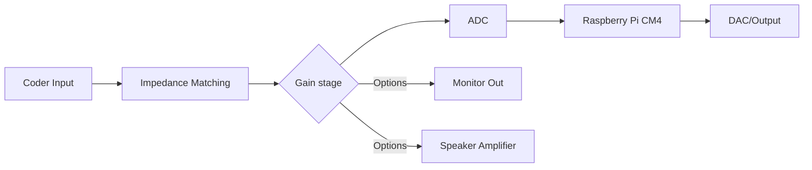

# Project Proposal - Guitar Effects Unit
Our proposal is to create a guitar effects unit that aims to provide a more flexible solution to people wanting to use an amplifier or effects with their guitar or other similar instruments. The traditional analog guitar effects chain is fairly complicated and expensive and we are aiming to simplify that by condensing effects processing into one unit.

Simplified Block Diagram

Definitions
- ADC - Analog to Digital converter
- DAC - Digital to Analog converter
- XLR - Type of audio connector 
- DSP - Digital Signal Processing

# Requirements
- 1U form factor
- XLR outputs
- High impedance guitar input
    - Needed for impedance matching; without this the clean guitar signal will sound off

## Nice-to-haves
- High sampling rate for the analog to digital conversion 
    - Reduces latency but puts more strain on the computer 
    - Also limits the options for hardware
- 8 ohm speaker out 
    - Would add the most complexity to the hardware 
- MIDI control
    - With MIDI control you can use a MIDI foot controller which emulates the form factor and workflow of traditional guitar pedals 
    - Would add the most complexity to the software side but depends on the software being used
- Analog Monitor output	
    - The DSP part of the system naturally adds some delay which could be an issue in some cases, mainly monitoring hence the name, so having an analog monitor out would avoid adding any delay
    - Would be the simplest to add

| Function                              | 1               | 2               | 3               | 4               |
|---------------------------------------| --------------- | --------------- | --------------- | --------------- |
| Output Audio                          | XLR             | Line            | N/A             | N/A             |
| Impedance Matching (based on input)   | 100kΩ           | 500kΩ           | 1MΩ             | N/A             |
| Portable                              | 1U              | 2U              | 3U              | N/A             |
| Sampling Rate                         | 44100Hz         | 48000Hz         | 88200Hz         | 96000Hz         |

## Progress Report / Task Chart
So far, because of the complexity of standard effect chains, several requirements for our effects unit have been developed. Firstly, XLR outputs are necessary in order to properly connect to other audio equipment. Secondly, a high impedance input is needed in order to provide a clean input signal; without this, the instrument will sound muddy and off. Lastly, we require a 1U (1.75” height) form factor. This is to  provide users with the ability to transport the unit without considerable effort, so that other supplies can be carried along with the unit. 

While not hard requirements, we have several functions that would be nice to integrate into our unit design. One of these functions is analog monitor output. Because of the conversion from analog to digital signals, our unit inherently introduces a delay to the entire system; a delay that using analog monitors would remove. Another workaround to this delay would be a high sampling rate for our ADCs (Analog-Digital Converter). While this would reduce the delay introduced by the unit, high sampling rates also require better hardware that is able to keep up with sampling rates. To reflect these hard and soft requirements, we have created a decision matrix with several solutions, and have modularized work in order to assign it to individual team members.

# Presentation
[Slides link (with editor access)](https://docs.google.com/presentation/d/1k-_Xbwdici6hV1Nm7ExJK9yDvCZzb60pYfbO3nlM_dQ/edit?usp=sharing)

# Report
[Docs link (with viewer accesss)](https://docs.google.com/document/d/1ml5jPTLHlhFTG2CWHP0VoW_UAEkIt0Kg1A3PQ4HniN0/edit?usp=sharing)
